DOOM
====

Play in your browser:
https://fahrettinenes.github.io/fahrettinenes/

About
-----

This is DOOM, running in the browser through WebAssembly. Click the
banner above or open the link to play. Nothing to install.

Controls
--------

  Up / Down          Move forward / back
  Left / Right       Turn
  Alt + Left/Right   Strafe
  1 to 7             Select weapon
  Ctrl               Fire
  Space              Open / use
  Shift              Run
  Esc                Menu

How it is built
---------------

Engine
  Dwasm, which is PrBoom+ compiled to WebAssembly (GPL-2.0).
  https://github.com/GMH-Code/Dwasm

Game data
  Freedoom, a free and open IWAD that contains no copyrighted
  assets.
  https://freedoom.github.io/

Legal
-----

Not affiliated with id Software, Bethesda, or ZeniMax. DOOM is
their trademark. The engine is licensed under the GPL; the game
assets come from Freedoom.